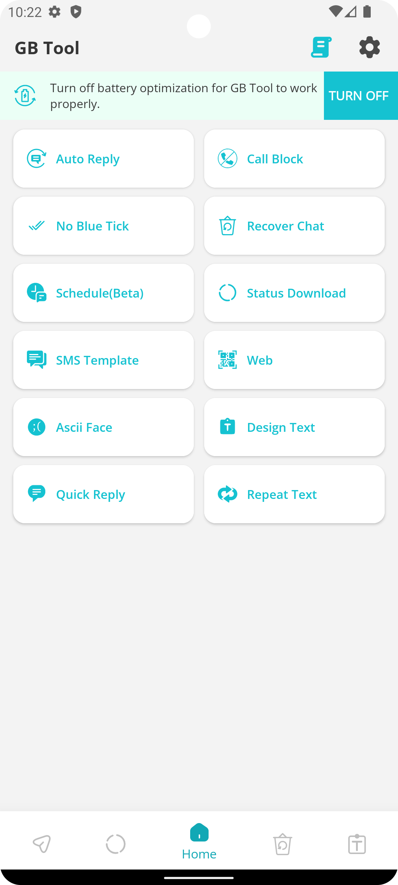

# GB WhatsApp Clone

GB WhatsApp Clone is an enhanced version of the popular messaging app, designed to give users more control over their messaging experience. With advanced features such as Auto Reply, Call Block, Chat Scheduling, and No Blue Tick, this app takes your WhatsApp usage to the next level. Enjoy customization and features that are not available in the standard version of WhatsApp.

  

## Core Features

### Auto Reply
- Implemented using Android's Notification API for intuitive user experience.
- Supports keyword-based replies, contact-specific responses, and a history log for tracking.

### Call Block
- Leverages Notification API to offer robust call blocking capabilities.
- Users can block calls by caller name, time frames, or even unsaved contacts, offering a high degree of personalization and privacy.

### Schedule Chat
- Integrates Android Accessibility API to allow users to schedule messages at specified times and dates.
- Provides the option to send multiple types of media, such as audio, text, photos, and videos, and even to schedule WhatsApp statuses, showcasing a multi-faceted approach to task automation.

### No Blue Tick
- Utilizes Android File Observer API to discreetly manage media files.
- Offers users the choice to view media without sending read confirmations and to recover files even after they've been deleted by the sender.

## Advanced Functionalities

- **SMS Template**: Create and use message templates for quick responses.
- **Status Download**: Save the statuses shared by your contacts easily.
- **Design Text**: Customize your text messages with different fonts and styles.
- **And More**: Discover additional tools to enhance your messaging experience.

## Technical Details

- **Auto Reply**: Built using Android Notification API, this feature allows users to set custom replies for convenience and efficiency.
- **Call Blocking**: Implemented using the same Android Notification API, it gives users the ability to block calls based on various filters.
- **Chat Scheduling**: The scheduling functionality leverages the Android Accessibility API to give users the power to schedule messages precisely.
- **Media Privacy**: The No Blue Tick feature uses the Android File Observer API to smartly manage media visibility and privacy.

## Screenshots

## Auto Reply Screen

  
  &nbsp;&nbsp;&nbsp;
   

Here are some screenshots to give you a glimpse of what My Amazing App looks like:

## Schedule Chat Screen

  
  &nbsp;&nbsp;&nbsp;
   
   &nbsp;&nbsp;&nbsp;
   
   &nbsp;&nbsp;&nbsp;
   

## No Blue Tick Screen

  
  &nbsp;&nbsp;&nbsp;
   

Giving credit to other developers whose work you've incorporated into your project is an important aspect of collaborating in the open-source community, even if your project is private and for showcase purposes. Here's how to appropriately give credit in your README:

---

## Acknowledgments

Special thanks to the following developers and projects whose work contributed significantly to the success of the GB WhatsApp Clone:

- **adeekshith**: The integration of the [watomatic](https://github.com/adeekshith/watomatic) repository was crucial for the Auto Reply feature. It provided a robust starting point and significantly accelerated the development process.

- **92lleo**: Utilizing [WhatsappWebToGo](https://github.com/92lleo/WhatsappWebToGo) enabled the seamless implementation of the WhatsApp Web feature. Their innovative approach and codebase were indispensable.

Their work provided a solid foundation and saved valuable time, showcasing the spirit of the open-source community.

## Contact
For more information about my work, or to discuss employment opportunities, please contact me at subashisguchait10@gmail.com .

## License
This is a private project, not licensed for public use or distribution. The contents are intended for review by the intended recipient only.
