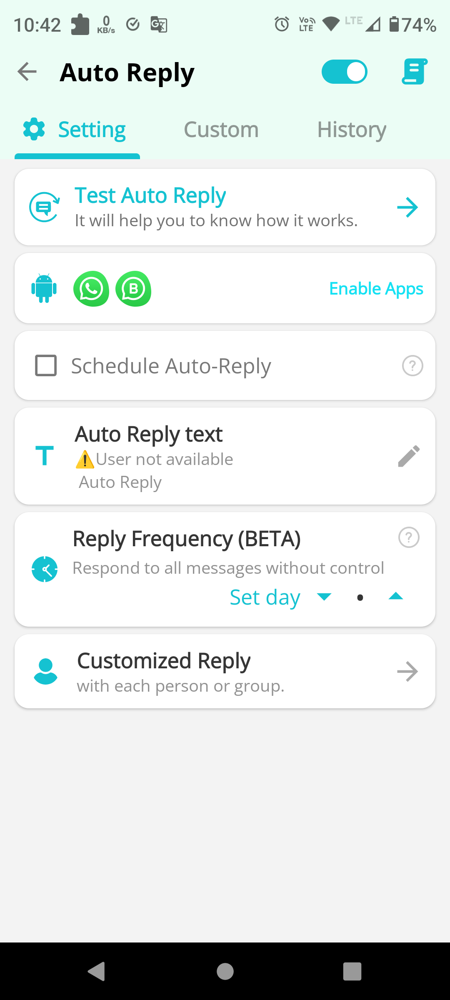
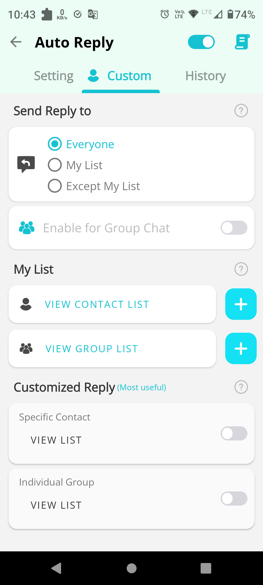
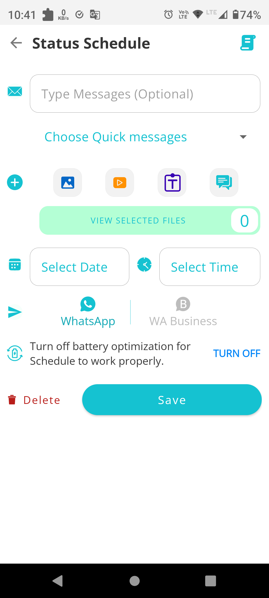
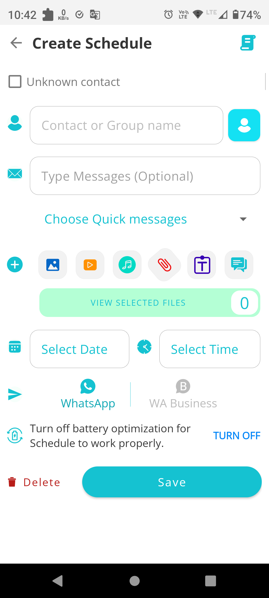

# GB WhatsApp Clone – Technical Showcase

Welcome to the GB WhatsApp Clone, an Android application crafted as a technical showcase to demonstrate advanced programming skills, API usage, and a deep understanding of Android development paradigms. This app mirrors the functionality of WhatsApp and introduces enhanced features that push the boundaries of messaging applications.

## Core Features

### Auto Reply
- Implemented using Android's Notification API for intuitive user experience.
- Supports keyword-based replies, contact-specific responses, and a history log for tracking.

### Call Block
- Leverages Notification API to offer robust call blocking capabilities.
- Users can block calls by caller name, time frames, or even unsaved contacts, offering a high degree of personalization and privacy.

### Schedule Chat
- Integrates Android Accessibility API to allow users to schedule messages at specified times and dates.
- Provides the option to send multiple types of media, such as audio, text, photos, and videos, and even to schedule WhatsApp statuses, showcasing a multi-faceted approach to task automation.

### No Blue Tick
- Utilizes Android File Observer API to discreetly manage media files.
- Offers users the choice to view media without sending read confirmations and to recover files even after they've been deleted by the sender.

## Technical Highlights

This project serves as a testament to my ability to:
- Work with Android's Notification and Accessibility APIs.
- Design and implement a user-friendly interface while maintaining performance and efficiency.
- Handle file operations in a privacy-conscious manner.
- Manage state and user interactions across a variety of contexts.

## Screenshots

## Home Screen

  

## Auto Reply Screen

  
  &nbsp;&nbsp;&nbsp;
   

Here are some screenshots to give you a glimpse of what My Amazing App looks like:

## Schedule Chat Screen

  
  &nbsp;&nbsp;&nbsp;
   
   &nbsp;&nbsp;&nbsp;
   
   &nbsp;&nbsp;&nbsp;
   

## No Blue Tick Screen

  
  &nbsp;&nbsp;&nbsp;
   

## Contact
For more information about my work, or to discuss employment opportunities, please contact me at subashisguchait10@gmail.com .

## License
This is a private project, not licensed for public use or distribution. The contents are intended for review by the intended recipient only.
